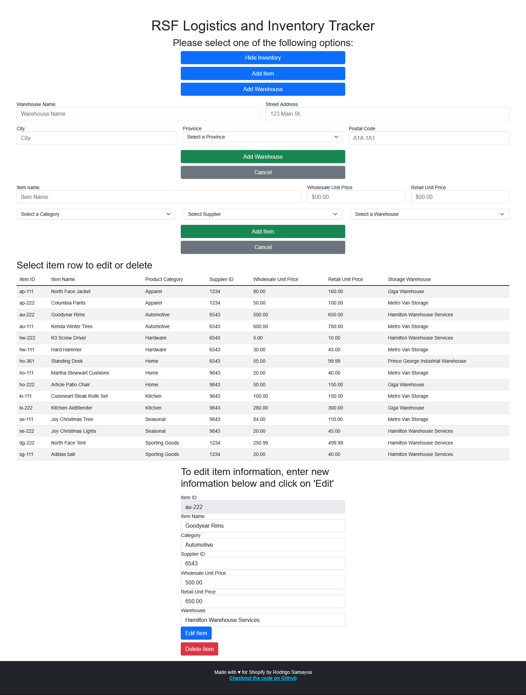

# RSF Logistics and Inventory Tracker
The RSF Logistics and Inventory Tracker is an app built for the Summer 2022 Shopify Intern Challenge. 

The app is a basic logistics and invery application that allows users to view an inventory list, add, edit and delete items, and create warehouses to store those items. 

A hosted web version of the app can be found at 

## Stack
The app has a PostgreSQL relational database to store inventory data, Express JS for back end server and Pug JS as the view engine. 

## Run Locally
To run the application locally you will need Node.js and a PostgreSQL database. 

1. Clone repo locally
2. Run `npm install` to install dependencies
3. After setting up a PostgreSQL database, run the SQL scripts provided to create a local instance of the relational database. 
